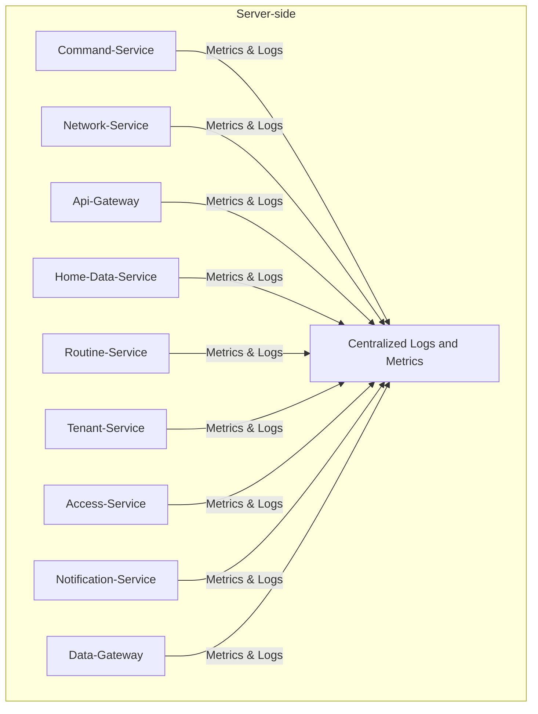

# Logging and Metrics

```mermaid
    graph TD

    subgraph Server-side
        Api-Gateway
        Data-Gateway
        Home-Data-Service
        Network-Service
        Command-Service
        Routine-Service
        Tenant-Service
        Access-Service
        CentralizedLogs[Centralized Logs and Metrics]
        Notification-Service
    end
    
   
    Command-Service -->|Metrics & Logs| CentralizedLogs
    Network-Service -->|Metrics & Logs| CentralizedLogs
    Api-Gateway -->|Metrics & Logs| CentralizedLogs
    Home-Data-Service -->|Metrics & Logs| CentralizedLogs
    Routine-Service -->|Metrics & Logs| CentralizedLogs
    Tenant-Service -->|Metrics & Logs| CentralizedLogs
    Access-Service -->|Metrics & Logs| CentralizedLogs
    Notification-Service -->|Metrics & Logs| CentralizedLogs
    Data-Gateway -->|Metrics & Logs| CentralizedLogs
    
    
    
```
