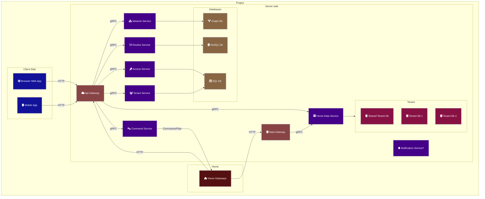

# Service Architecture

```mermaid
graph TD
    subgraph Project
        subgraph Client-Side
            B[fa:fa-globe Browser Web App]
            M[fa:fa-mobile Mobile App]
        end
        
        subgraph Home
            HG[fa:fa-home Home Gateways]
        end

        subgraph Server-side
            AGW[fa:fa-cloud Api Gateway]
            DGW[fa:fa-database Data Gateway]
            HDS[fa:fa-server Home Data Service]
            NS[fa:fa-network-wired Network Service]
            CS[fa:fa-cogs Command Service]
            RS[fa:fa-tasks Routine Service]
            TS[fa:fa-users Tenant Service]
            AS[fa:fa-key Access Service]
            NSC[fa:fa-bell Notification Service?]

            subgraph Databases
                GRAPH_DB[fa:fa-project-diagram Graph Db]
                NOSQL_DB[fa:fa-database NoSQL Db]
                SQL_DB[fa:fa-table SQL Db]
            end

            subgraph Tenant
                T_DBn[fa:fa-database Shared Tenant Db]
                T_DB1[fa:fa-database Tenant Db 1]
                T_DB2[fa:fa-database Tenant Db 2]
            end
        end
    end

    B -->|HTTP| AGW
    M -->|HTTP| AGW
    HG -->|HTTP| AGW
    HG -->|HTTP| DGW
    
    AGW -->|gRPC| HDS
    AGW -->|gRPC| NS
    AGW -->|gRPC| CS
    AGW -->|gRPC| RS
    AGW -->|gRPC| TS
    AGW -->|gRPC| AS
    DGW -->|gRPC| HDS
    HDS --> Tenant

    CS -->|Commands/Pipe| HG

    %%RS --> AS
    %%NS --> AS
    %%CS --> AS
    %%HDS --> AS
    %%CS --> AS
    %%AS --> TS

    NS --> GRAPH_DB
    RS --> NOSQL_DB
    AS --> SQL_DB
    TS --> SQL_DB

    classDef client fill:#119,stroke:#bbb,stroke-width:2px, color:#fff, padding:10px;
    classDef home fill:#511,stroke:#bbb,stroke-width:2px, color:#fff, padding:10px;
    classDef server fill:#555,stroke:#bbb,stroke-width:2px, color:#fff, padding:10px;
    classDef api fill:#844,stroke:#bbb,stroke-width:2px, color:#fff, padding:10px;
    classDef service fill:#408,stroke:#bbb,stroke-width:2px, color:#fff, padding:10px;
    classDef database fill:#864,stroke:#bbb,stroke-width:2px, color:#fff, padding:10px;
    classDef tenant fill:#814,stroke:#bbb,stroke-width:2px, color:#fff, padding:10px;

    class B,M client;
    class HG home;
    class AGW,DGW api;
    class NS,CS,RS,TS,AS,NSC,HDS,HDS_DB service;
    class NOSQL_DB,SQL_DB,GRAPH_DB database;
    class T_DB1,T_DB2,T_DBn tenant;

```